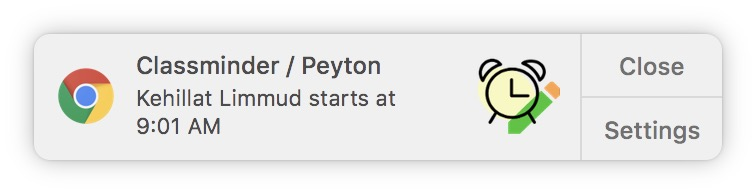
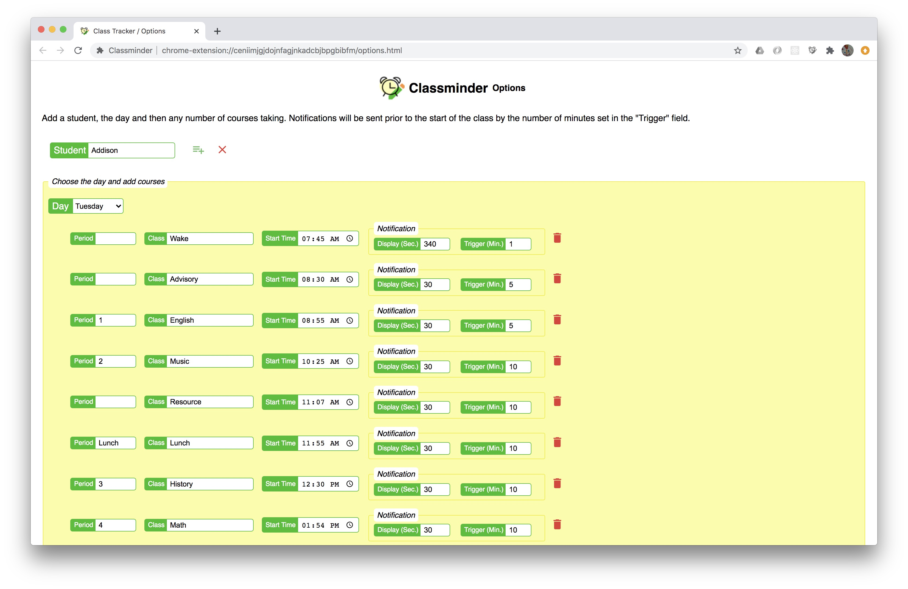

#  Classminder / Chrome Extension

Classminder lets you receive desktop notifications when your kids classes are about to begin. 

## Installation

1. Clone this repository. 
   `git clone git@github.com:kluman/class-tracker.git`
2. Open your Chrome browser and open the Extension Management page by navigating to _chrome://extensions_.
   * The Extension Management page can also be opened by clicking on the Chrome menu, hovering over More Tools then selecting Extensions. 
3. Enable Developer Mode by clicking the toggle switch next to Developer mode.
4. Click the LOAD UNPACKED button and select the 'src' of the cloned directory.
5. Open the Options page to setup your notifications.

### Addition Information

Chrome Extensions Getting Started:  https://developer.chrome.com/extensions/getstarted
